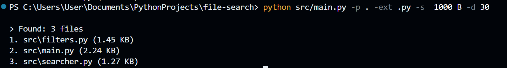

# File search

## Description

A command-line tool for searching files in a specified directory using different search criteria.

---

## Demo



---

## Features

The program supports searching:

- by file name or the beginning of a file name;
- by file extension (for example, .txt or .py);
- by minimum file size, with support for bytes, KB, MB, and GB;
- for files modified within the last N days;
- by searching for specific text inside files.

The program uses `argparse` to handle command-line arguments. The path to the directory is required, while all other search options are optional.

**Error Handling**

> If the user enters invalid search parameters, the program will display an error message. The search request must then be entered again with valid data.

**Limitations**

> Searching through large directories containing a large number of files may take some time, especially when searching by file content, as the program needs to examine many files individually.

---

## Technologies

- `argparse` — for parsing command-line arguments and handling the CLI interface.
- `pathlib.Path` — for working with file and directory paths.
- `datetime.fromtimestamp()` — for converting a file's modification timestamp into a readable date and time.
- `datetime` — for calculating the time difference between the current local time and the file's modification time to find files modified within the specified number of days.

---

## Project Structure
``` text
File-search/
├── LICENSE
├── README.md
├── .gitignore
│
└── src/
    ├── main.py
    ├── filters.py
    └── searcher.py
```

---

## Project Architecture

The application separates the search process into several logical layers:

1. `main.py` receives and parses the user's command-line arguments.
2. `searcher.py` traverses the target directory and processes the files.
3. `filters.py` checks each file against the selected search criteria.
4. Matching files are returned to main.py, where the results are formatted and displayed to the user.

---

## Installation

1. Clone the repository:

``` bash
git clone git@github.com:ss29enter/File-search.git
```

2. Navigate to the project folder:

``` bash
cd File-search
```

3. Run the program:

``` bash
python src/main.py -h
```

---

## Usage

To see all available commands and options, run the program with the `-h` flag:

```bash
python src/main.py -h
```
The basic command structure:

```bash
python src/main.py -p <path> [options]
```

**Available options**

| Flag   | Description                                                       |
| ------ | ----------------------------------------------------------------- |
| `-p`  | Path to the directory for searching (required)                    |
| `-n`   | Search files by name or the beginning of the name                 |
| `-ext` | Search files by extension (for example, `.py`, `.txt`)            |
| `-d`   | Search files modified within the last `N` days                    |
| `-s`   | Search files with a minimum size (supports bytes, KB, MB, and GB) |
| `-S`   | Search for a specific sequence of characters inside files         |

---

## Examples

Search for files by name:

```bash
python src/main.py -p ./documents -n report
```
Search for Python files:

```bash
python src/main.py -p ./projects -ext .py
```
Search for files larger than 10 MB:

```bash
python src/main.py -p ./downloads -s 10 MB
```
Search for files modified within the last 7 days:

```bash
python src/main.py -p ./folder -d 7
```

Search for text inside files:

```bash
python src/main.py -p ./documents -S "example text"
```
Multiple search criteria can be used together:

```bash
python src/main.py -p ./projects -ext .py -s 1 MB -d 30
```
The program will display all files that match the specified conditions.

---

## Future Improvements

- Improve search performance for large directories.
- Add support for regular expressions.
- Add unit tests.

---

## License

This project is licensed under the MIT License. See the [LICENSE](LICENSE) file for details.